# OptiFlow OS — Executive Engineering Dashboard
> Auto-generated: 2026-07-05T16:03:59.423Z
> Schema: V5.0 AI-native feature registry

## Repository Overview

| Dimension | Value |
|-----------|-------|
| Project | OptiFlow OS Website |
| Purpose | Marketing website for OptiFlow OS — Business Execution Operating System for Indi... |
| Tech Stack | Static HTML/CSS/JS, Node.js build pipeline, Cloudflare Pages + Netlify |
| Architecture | Pages-based static site (15 pages) with custom design system |
| AI Readiness | V5.0 — AI-native feature registry |
| Spec Directories | 28 |
| Archive Records | 33 directories (33 in index) |
| Orchestration Module | 48 modules (V13 engine) |

## Engineering Progress

| Metric | Value |
|--------|-------|
| Total Features | 68 |
| Complete | 36 (53%) 🟡 |
| In Progress | 0 |
| Planned | 31 |
| Dependency Cycles | 0 |
| Traceability Gaps | 3 |
| Orphan Features | 2 |

## Architecture Health

| Component | Status | Detail |
|-----------|:---:|--------|
| Build Pipeline | 🟢 | 0 errors on npm run build |
| L1-L7 Validation | 🟢 | All levels passing |
| Spec Coverage | 🔴 | 28 specs for 68 features |
| Archive Health | 🟢 | 33 entries, 33 dirs |
| Feature Integrity | 🟡 | 3 gap(s) found |

## Feature Health by Prefix

| Prefix | Total | Complete | Planned | Health |
|--------|-------|----------|---------|:---:|
| API | 6 | 6 | 0 | 🟢 100% |
| CONTENT | 4 | 0 | 4 | 🔴 0% |
| DOCS | 5 | 0 | 5 | 🔴 0% |
| LEAD | 2 | 2 | 0 | 🟢 100% |
| LEGAL | 2 | 2 | 0 | 🟢 100% |
| OPS | 6 | 2 | 4 | 🔴 33% |
| PAGE | 8 | 8 | 0 | 🟢 100% |
| PERF | 4 | 0 | 4 | 🔴 0% |
| QA | 3 | 3 | 0 | 🟢 100% |
| SEC | 4 | 0 | 4 | 🔴 0% |
| SYS | 5 | 5 | 0 | 🟢 100% |
| TEST | 5 | 0 | 5 | 🔴 0% |
| UI | 14 | 8 | 5 | 🟡 57% |

## Traceability Gaps (3)

| Feature | Gap | Severity |
|---------|-----|----------|
| LEGAL-002 Terms & Conditions | no archive entry | medium |
| OPS-001 Orchestration Engine | no archive entry | medium |
| UI-007 Service Worker & PWA Enhancement | no archive entry | medium |

## Orphan Features (2)

- **LEGAL-002** Terms & Conditions — complete but missing specs or archive
- **UI-007** Service Worker & PWA Enhancement — complete but missing specs or archive

## Dependency Graph

```mermaid
graph TD
  SYS-001[Design System & Theming] --> SYS-002[Site Navigation & Structu]
  SYS-001[Design System & Theming] --> SYS-003[Interactive Runtime]
  SYS-001[Design System & Theming] --> SYS-004[Build & Deployment Pipeli]
  SYS-001[Design System & Theming] --> SYS-005[SEO & Metadata]
  SYS-001[Design System & Theming] --> PAGE-001[Home Page]
  SYS-002[Site Navigation & Structu] --> PAGE-001[Home Page]
  SYS-001[Design System & Theming] --> PAGE-002[Problem & Solutions]
  SYS-002[Site Navigation & Structu] --> PAGE-002[Problem & Solutions]
  SYS-001[Design System & Theming] --> PAGE-003[Product Overview]
  SYS-002[Site Navigation & Structu] --> PAGE-003[Product Overview]
  SYS-001[Design System & Theming] --> PAGE-004[Feature Showcase]
  SYS-002[Site Navigation & Structu] --> PAGE-004[Feature Showcase]
  SYS-001[Design System & Theming] --> PAGE-005[Competitive Positioning]
  SYS-002[Site Navigation & Structu] --> PAGE-005[Competitive Positioning]
  SYS-001[Design System & Theming] --> PAGE-006[Pricing & Plans]
  SYS-002[Site Navigation & Structu] --> PAGE-006[Pricing & Plans]
  SYS-001[Design System & Theming] --> PAGE-007[Newsletter & Content]
  SYS-002[Site Navigation & Structu] --> PAGE-007[Newsletter & Content]
  SYS-001[Design System & Theming] --> PAGE-008[FAQ & Self-Service]
  SYS-002[Site Navigation & Structu] --> PAGE-008[FAQ & Self-Service]
  SYS-001[Design System & Theming] --> LEAD-001[Demo Booking]
  SYS-002[Site Navigation & Structu] --> LEAD-001[Demo Booking]
  API-001[Form Processing API] --> LEAD-001[Demo Booking]
  SYS-001[Design System & Theming] --> LEAD-002[Contact & Support]
  SYS-002[Site Navigation & Structu] --> LEAD-002[Contact & Support]
  API-001[Form Processing API] --> LEAD-002[Contact & Support]
  SYS-001[Design System & Theming] --> LEGAL-001[Privacy Policy]
  SYS-001[Design System & Theming] --> LEGAL-002[Terms & Conditions]
  SYS-004[Build & Deployment Pipeli] --> API-001[Form Processing API]
  SYS-004[Build & Deployment Pipeli] --> API-002[Admin Authentication]
  API-005[Database & Data Managemen] --> API-002[Admin Authentication]
  SYS-004[Build & Deployment Pipeli] --> API-003[Admin Dashboard]
  API-002[Admin Authentication] --> API-003[Admin Dashboard]
  API-005[Database & Data Managemen] --> API-003[Admin Dashboard]
  SYS-004[Build & Deployment Pipeli] --> API-004[Email Notifications]
  SYS-004[Build & Deployment Pipeli] --> API-005[Database & Data Managemen]
  SYS-004[Build & Deployment Pipeli] --> API-006[Monitoring & Observabilit]
  SYS-001[Design System & Theming] --> QA-001[Accessibility Compliance]
  SYS-004[Build & Deployment Pipeli] --> QA-002[Testing Suite]
  SYS-004[Build & Deployment Pipeli] --> QA-003[Code Quality & Performanc]
  OPS-001[Orchestration Engine] --> OPS-002[Git Hooks & Automation]
  SYS-001[Design System & Theming] --> UI-001[Motion & Animation System]
  SYS-001[Design System & Theming] --> UI-002[Page Transition Animation]
  UI-001[Motion & Animation System] --> UI-002[Page Transition Animation]
  SYS-001[Design System & Theming] --> UI-003[Skeleton Loading & Empty ]
  SYS-001[Design System & Theming] --> UI-004[Toast & Notification Syst]
  SYS-001[Design System & Theming] --> UI-005[Cookie Consent & Privacy ]
  SYS-004[Build & Deployment Pipeli] --> UI-006[Image Optimization Pipeli]
  PERF-002[Asset Caching & CDN Strat] --> UI-006[Image Optimization Pipeli]
  SYS-004[Build & Deployment Pipeli] --> UI-007[Service Worker & PWA Enha]
  PERF-002[Asset Caching & CDN Strat] --> UI-007[Service Worker & PWA Enha]
  SYS-001[Design System & Theming] --> UI-008[Interactive Product Demo ]
  UI-001[Motion & Animation System] --> UI-008[Interactive Product Demo ]
  SYS-003[Interactive Runtime] --> UI-009[Site Search Functionality]
  API-005[Database & Data Managemen] --> UI-009[Site Search Functionality]
  SYS-003[Interactive Runtime] --> UI-010[Error Boundary & Recovery]
  SYS-001[Design System & Theming] --> UI-011[Hero Section Motion Enhan]
  UI-001[Motion & Animation System] --> UI-011[Hero Section Motion Enhan]
  SYS-003[Interactive Runtime] --> UI-012[Scroll-Triggered Animatio]
  UI-001[Motion & Animation System] --> UI-012[Scroll-Triggered Animatio]
  SYS-001[Design System & Theming] --> UI-013[Card & Component Interact]
  SYS-004[Build & Deployment Pipeli] --> UI-014[Content Freshness & Last ]
  SYS-004[Build & Deployment Pipeli] --> PERF-001[Critical CSS Extraction]
  SYS-004[Build & Deployment Pipeli] --> PERF-002[Asset Caching & CDN Strat]
  SYS-001[Design System & Theming] --> PERF-003[Font Self-Hosting & Subse]
  SYS-004[Build & Deployment Pipeli] --> PERF-004[Lighthouse CI Pipeline In]
  QA-003[Code Quality & Performanc] --> PERF-004[Lighthouse CI Pipeline In]
  API-001[Form Processing API] --> SEC-001[CSRF Protection]
  API-001[Form Processing API] --> SEC-002[Input Sanitization & XSS ]
  SYS-004[Build & Deployment Pipeli] --> SEC-003[SRI Hash Injection]
  API-006[Monitoring & Observabilit] --> SEC-004[CSP Reporting Endpoint]
  QA-002[Testing Suite] --> TEST-001[Unit Testing Framework]
  QA-002[Testing Suite] --> TEST-002[API Integration Tests]
  TEST-001[Unit Testing Framework] --> TEST-002[API Integration Tests]
  QA-002[Testing Suite] --> TEST-003[Visual Regression Testing]
  QA-001[Accessibility Compliance] --> TEST-004[Accessibility Manual Audi]
  QA-003[Code Quality & Performanc] --> TEST-005[Performance Profiling Sui]
  PERF-004[Lighthouse CI Pipeline In] --> TEST-005[Performance Profiling Sui]
  API-001[Form Processing API] --> DOCS-001[API Documentation Generat]
  API-004[Email Notifications] --> DOCS-001[API Documentation Generat]
  OPS-001[Orchestration Engine] --> DOCS-002[Architecture Decision Rec]
  OPS-002[Git Hooks & Automation] --> DOCS-003[Changelog Automation]
  SYS-004[Build & Deployment Pipeli] --> DOCS-004[Deployment Runbook]
  SYS-001[Design System & Theming] --> DOCS-005[Component Catalog Documen]
  PAGE-007[Newsletter & Content] --> CONTENT-001[Newsletter Content Pipeli]
  PAGE-001[Home Page] --> CONTENT-002[Case Studies & Customer S]
  CONTENT-001[Newsletter Content Pipeli] --> CONTENT-002[Case Studies & Customer S]
  PAGE-001[Home Page] --> CONTENT-003[Product Roadmap & Release]
  DOCS-003[Changelog Automation] --> CONTENT-003[Product Roadmap & Release]
  PAGE-007[Newsletter & Content] --> CONTENT-004[Blog Engine & Content Man]
  UI-009[Site Search Functionality] --> CONTENT-004[Blog Engine & Content Man]
  API-006[Monitoring & Observabilit] --> OPS-003[Monitoring & Alerting Pip]
  SYS-004[Build & Deployment Pipeli] --> OPS-003[Monitoring & Alerting Pip]
  API-005[Database & Data Managemen] --> OPS-004[Backup & Disaster Recover]
  OPS-001[Orchestration Engine] --> OPS-005[OpenSpec Coverage Reporti]
  OPS-001[Orchestration Engine] --> OPS-006[Orchestration Engine Docu]
```

---

> Generated by orchestrate/feature-engine.mjs V2.0 on 2026-07-05T16:03:59.423Z