# Traceability Matrix
> Auto-generated from features.json + openspec/ + archive/
> 2026-07-05T16:03:59.488Z

Every Feature ID is the canonical source of truth. This matrix is auto-generated.

## Complete Features

| Feature ID | Name | Specs | Source Files | Archive |
|-----------|------|-------|-------------|---------|
| SYS-001 | Design System & Theming | design-system | - | design-system-core |
| SYS-002 | Site Navigation & Structure | build-pipeline, marketing-pages | - | 2026-06-30-site-nav-structure |
| SYS-003 | Interactive Runtime | accessibility, build-pipeline | - | 2026-06-30-interactive-runtime |
| SYS-004 | Build & Deployment Pipeline | build-pipeline, code-quality-pipeline | - | sys-004-build-deployment-pipeline |
| SYS-005 | SEO & Metadata | seo | - | sys-005-seo-metadata |
| PAGE-001 | Home Page | accessibility, build-pipeline | src/pages/home.html | page-001-home-page |
| PAGE-002 | Problem & Solutions | marketing-pages, competitive-positioning-page | src/pages/problem-solutions.html | 2026-06-30-page-002 |
| PAGE-003 | Product Overview | competitive-positioning-page, feature-showcase-page | src/pages/product-overview.html | 2026-06-30-page-003 |
| PAGE-004 | Feature Showcase | feature-showcase-page, marketing-pages | src/pages/feature-showcase.html, src/pages/features.html | 2026-06-30-page-004-feature-showcase |
| PAGE-005 | Competitive Positioning | competitive-positioning-page, marketing-pages | src/pages/competitive-positioning.html | 2026-06-30-competitive-positioning |
| PAGE-006 | Pricing & Plans | marketing-pages, competitive-positioning-page | src/pages/pricing.html | 2026-06-30-page-006-pricing |
| PAGE-007 | Newsletter & Content | marketing-pages, competitive-positioning-page | src/pages/newsletter.html | 2026-06-30-page-007-newsletter-content |
| PAGE-008 | FAQ & Self-Service | faq-self-service, marketing-pages | src/pages/faq.html | 2026-07-01-page-008-faq-self-service |
| LEAD-001 | Demo Booking | lead-capture, marketing-pages | src/pages/demo-booking.html | 2026-07-01-lead-001-demo-booking |
| LEAD-002 | Contact & Support | contact-support, lead-capture | src/pages/contact.html | 2026-07-01-lead-002 |
| LEGAL-001 | Privacy Policy | legal-pages | src/pages/privacy-policy.html | 2026-07-01-legal-001 |
| LEGAL-002 | Terms & Conditions | legal-pages, marketing-pages | src/pages/terms.html | 🚫 |
| API-001 | Form Processing API | form-processing-api, lead-capture | functions/api/form-submit.js | 2026-07-01-api-001-form-processing-api |
| API-002 | Admin Authentication | admin-authentication, form-processing-api | src/pages/admin.html | 2026-07-01-api-002 |
| API-003 | Admin Dashboard | admin-authentication, form-processing-api | src/pages/admin.html | 2026-07-01-api-003-admin-dashboard |
| API-004 | Email Notifications | email-notifications, form-processing-api | - | 2026-07-01-api-004-email-notifications |
| API-005 | Database & Data Management | admin-authentication, database-data-management | - | 2026-07-01-api-005-database-data-management |
| API-006 | Monitoring & Observability | platform-monitoring, form-processing-api | - | 2026-07-01-api-006 |
| QA-001 | Accessibility Compliance | accessibility | - | 2026-07-01-qa-001-accessibility-compliance |
| QA-002 | Testing Suite | build-pipeline, testing-suite | - | 2026-07-01-qa-002 |
| QA-003 | Code Quality & Performance | build-pipeline, code-quality-pipeline | - | 2026-07-01-qa-003-code-quality-performance |
| OPS-001 | Orchestration Engine | orchestration-engine | - | 🚫 |
| OPS-002 | Git Hooks & Automation | build-pipeline, code-quality-pipeline | - | 2026-07-01-ops-002-git-hooks-automation |
| UI-001 | Motion & Animation System Enhanceme | design-system | - | ui-001-motion-system |
| UI-002 | Page Transition Animations | design-system, competitive-positioning-page | - | ui-002-page-transitions |
| UI-003 | Skeleton Loading & Empty States | skeleton-loading | - | 2026-07-03-id-ui-003-name-skeleton-loading-empty-st |
| UI-004 | Toast & Notification System | design-system | - | design-system-core |
| UI-005 | Cookie Consent & Privacy Compliance | cookie-consent | src/pages/privacy-policy.html | 2026-07-04-ui-005-cookie-consent-privacy-compliance |
| UI-006 | Image Optimization Pipeline | build-pipeline, code-quality-pipeline | - | 2026-07-04-image-optimization-pipeline |
| UI-007 | Service Worker & PWA Enhancement | build-pipeline | - | 🚫 |
| UI-008 | Interactive Product Demo Mockups | accessibility, build-pipeline | src/pages/demo-booking.html, src/pages/product-overview.html | 2026-06-30-interactive-runtime |

## Traceability Gaps (3)

| Feature ID | Name | Gap | Severity |
|-----------|------|-----|----------|
| LEGAL-002 | Terms & Conditions | no archive entry | medium |
| OPS-001 | Orchestration Engine | no archive entry | medium |
| UI-007 | Service Worker & PWA Enhancement | no archive entry | medium |

## Dependency Graph

```mermaid
graph TD
  SYS-001[Design System & Theming] --> SYS-002[Site Navigation & Structu]
  SYS-001[Design System & Theming] --> SYS-003[Interactive Runtime]
  SYS-001[Design System & Theming] --> SYS-004[Build & Deployment Pipeli]
  SYS-001[Design System & Theming] --> SYS-005[SEO & Metadata]
  SYS-001[Design System & Theming] --> PAGE-001[Home Page]
  SYS-002[Site Navigation & Structu] --> PAGE-001[Home Page]
  SYS-001[Design System & Theming] --> PAGE-002[Problem & Solutions]
  SYS-002[Site Navigation & Structu] --> PAGE-002[Problem & Solutions]
  SYS-001[Design System & Theming] --> PAGE-003[Product Overview]
  SYS-002[Site Navigation & Structu] --> PAGE-003[Product Overview]
  SYS-001[Design System & Theming] --> PAGE-004[Feature Showcase]
  SYS-002[Site Navigation & Structu] --> PAGE-004[Feature Showcase]
  SYS-001[Design System & Theming] --> PAGE-005[Competitive Positioning]
  SYS-002[Site Navigation & Structu] --> PAGE-005[Competitive Positioning]
  SYS-001[Design System & Theming] --> PAGE-006[Pricing & Plans]
  SYS-002[Site Navigation & Structu] --> PAGE-006[Pricing & Plans]
  SYS-001[Design System & Theming] --> PAGE-007[Newsletter & Content]
  SYS-002[Site Navigation & Structu] --> PAGE-007[Newsletter & Content]
  SYS-001[Design System & Theming] --> PAGE-008[FAQ & Self-Service]
  SYS-002[Site Navigation & Structu] --> PAGE-008[FAQ & Self-Service]
  SYS-001[Design System & Theming] --> LEAD-001[Demo Booking]
  SYS-002[Site Navigation & Structu] --> LEAD-001[Demo Booking]
  API-001[Form Processing API] --> LEAD-001[Demo Booking]
  SYS-001[Design System & Theming] --> LEAD-002[Contact & Support]
  SYS-002[Site Navigation & Structu] --> LEAD-002[Contact & Support]
  API-001[Form Processing API] --> LEAD-002[Contact & Support]
  SYS-001[Design System & Theming] --> LEGAL-001[Privacy Policy]
  SYS-001[Design System & Theming] --> LEGAL-002[Terms & Conditions]
  SYS-004[Build & Deployment Pipeli] --> API-001[Form Processing API]
  SYS-004[Build & Deployment Pipeli] --> API-002[Admin Authentication]
  API-005[Database & Data Managemen] --> API-002[Admin Authentication]
  SYS-004[Build & Deployment Pipeli] --> API-003[Admin Dashboard]
  API-002[Admin Authentication] --> API-003[Admin Dashboard]
  API-005[Database & Data Managemen] --> API-003[Admin Dashboard]
  SYS-004[Build & Deployment Pipeli] --> API-004[Email Notifications]
  SYS-004[Build & Deployment Pipeli] --> API-005[Database & Data Managemen]
  SYS-004[Build & Deployment Pipeli] --> API-006[Monitoring & Observabilit]
  SYS-001[Design System & Theming] --> QA-001[Accessibility Compliance]
  SYS-004[Build & Deployment Pipeli] --> QA-002[Testing Suite]
  SYS-004[Build & Deployment Pipeli] --> QA-003[Code Quality & Performanc]
  OPS-001[Orchestration Engine] --> OPS-002[Git Hooks & Automation]
  SYS-001[Design System & Theming] --> UI-001[Motion & Animation System]
  SYS-001[Design System & Theming] --> UI-002[Page Transition Animation]
  UI-001[Motion & Animation System] --> UI-002[Page Transition Animation]
  SYS-001[Design System & Theming] --> UI-003[Skeleton Loading & Empty ]
  SYS-001[Design System & Theming] --> UI-004[Toast & Notification Syst]
  SYS-001[Design System & Theming] --> UI-005[Cookie Consent & Privacy ]
  SYS-004[Build & Deployment Pipeli] --> UI-006[Image Optimization Pipeli]
  PERF-002[Asset Caching & CDN Strat] --> UI-006[Image Optimization Pipeli]
  SYS-004[Build & Deployment Pipeli] --> UI-007[Service Worker & PWA Enha]
  PERF-002[Asset Caching & CDN Strat] --> UI-007[Service Worker & PWA Enha]
  SYS-001[Design System & Theming] --> UI-008[Interactive Product Demo ]
  UI-001[Motion & Animation System] --> UI-008[Interactive Product Demo ]
  SYS-003[Interactive Runtime] --> UI-009[Site Search Functionality]
  API-005[Database & Data Managemen] --> UI-009[Site Search Functionality]
  SYS-003[Interactive Runtime] --> UI-010[Error Boundary & Recovery]
  SYS-001[Design System & Theming] --> UI-011[Hero Section Motion Enhan]
  UI-001[Motion & Animation System] --> UI-011[Hero Section Motion Enhan]
  SYS-003[Interactive Runtime] --> UI-012[Scroll-Triggered Animatio]
  UI-001[Motion & Animation System] --> UI-012[Scroll-Triggered Animatio]
  SYS-001[Design System & Theming] --> UI-013[Card & Component Interact]
  SYS-004[Build & Deployment Pipeli] --> UI-014[Content Freshness & Last ]
  SYS-004[Build & Deployment Pipeli] --> PERF-001[Critical CSS Extraction]
  SYS-004[Build & Deployment Pipeli] --> PERF-002[Asset Caching & CDN Strat]
  SYS-001[Design System & Theming] --> PERF-003[Font Self-Hosting & Subse]
  SYS-004[Build & Deployment Pipeli] --> PERF-004[Lighthouse CI Pipeline In]
  QA-003[Code Quality & Performanc] --> PERF-004[Lighthouse CI Pipeline In]
  API-001[Form Processing API] --> SEC-001[CSRF Protection]
  API-001[Form Processing API] --> SEC-002[Input Sanitization & XSS ]
  SYS-004[Build & Deployment Pipeli] --> SEC-003[SRI Hash Injection]
  API-006[Monitoring & Observabilit] --> SEC-004[CSP Reporting Endpoint]
  QA-002[Testing Suite] --> TEST-001[Unit Testing Framework]
  QA-002[Testing Suite] --> TEST-002[API Integration Tests]
  TEST-001[Unit Testing Framework] --> TEST-002[API Integration Tests]
  QA-002[Testing Suite] --> TEST-003[Visual Regression Testing]
  QA-001[Accessibility Compliance] --> TEST-004[Accessibility Manual Audi]
  QA-003[Code Quality & Performanc] --> TEST-005[Performance Profiling Sui]
  PERF-004[Lighthouse CI Pipeline In] --> TEST-005[Performance Profiling Sui]
  API-001[Form Processing API] --> DOCS-001[API Documentation Generat]
  API-004[Email Notifications] --> DOCS-001[API Documentation Generat]
  OPS-001[Orchestration Engine] --> DOCS-002[Architecture Decision Rec]
  OPS-002[Git Hooks & Automation] --> DOCS-003[Changelog Automation]
  SYS-004[Build & Deployment Pipeli] --> DOCS-004[Deployment Runbook]
  SYS-001[Design System & Theming] --> DOCS-005[Component Catalog Documen]
  PAGE-007[Newsletter & Content] --> CONTENT-001[Newsletter Content Pipeli]
  PAGE-001[Home Page] --> CONTENT-002[Case Studies & Customer S]
  CONTENT-001[Newsletter Content Pipeli] --> CONTENT-002[Case Studies & Customer S]
  PAGE-001[Home Page] --> CONTENT-003[Product Roadmap & Release]
  DOCS-003[Changelog Automation] --> CONTENT-003[Product Roadmap & Release]
  PAGE-007[Newsletter & Content] --> CONTENT-004[Blog Engine & Content Man]
  UI-009[Site Search Functionality] --> CONTENT-004[Blog Engine & Content Man]
  API-006[Monitoring & Observabilit] --> OPS-003[Monitoring & Alerting Pip]
  SYS-004[Build & Deployment Pipeli] --> OPS-003[Monitoring & Alerting Pip]
  API-005[Database & Data Managemen] --> OPS-004[Backup & Disaster Recover]
  OPS-001[Orchestration Engine] --> OPS-005[OpenSpec Coverage Reporti]
  OPS-001[Orchestration Engine] --> OPS-006[Orchestration Engine Docu]
```

## Spec Coverage by Category

| Category | Feature Count | Spec Count | Coverage % |
|----------|:---:|:---:|:---:|
| api | 6 | 15 | 250% |
| content | 4 | 12 | 300% |
| docs | 5 | 5 | 100% |
| lead | 2 | 5 | 250% |
| legal | 2 | 3 | 150% |
| operations | 6 | 7 | 117% |
| page | 8 | 27 | 338% |
| performance | 4 | 3 | 75% |
| quality | 3 | 8 | 267% |
| security | 4 | 5 | 125% |
| system | 5 | 11 | 220% |
| testing | 5 | 10 | 200% |
| ui | 14 | 22 | 157% |

---
> Generated by orchestrate/feature-engine.mjs V2.0